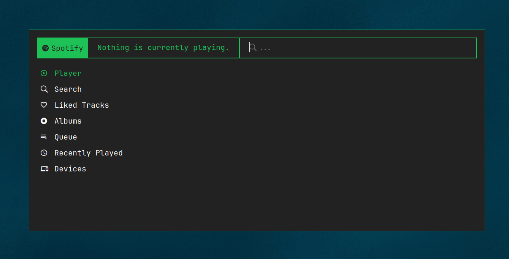

# spofi

> Spotify controls in rofi.

Spofi provides a method to control your spotify playback via a rofi menu.

**Please Note**: Spofi only works with Spotify premium accounts.



## Installation

Currently the application can be installed using go:

```bash
go install github.com/davidborzek/spofi@latest
```

### Setup

Run spofi in any terminal:

```bash
spofi
```

On the first run spofi will ask you to create a new configuration.
Follow the steps shown in your terminal to authenticate with spotify.

This step above will create a new configuration file under `~/.config/spofi/spofi.yaml`.

After the setup is done, you can normally run `spofi`.


### Custom Theme

If you want to use a custom theme for the menu, update config file with your theme:

```yaml
theme: /path/to/theme.rasi
```

or run spofi with the `--theme` flag:

```bash
spofi --theme /path/to/theme.rasi
```
